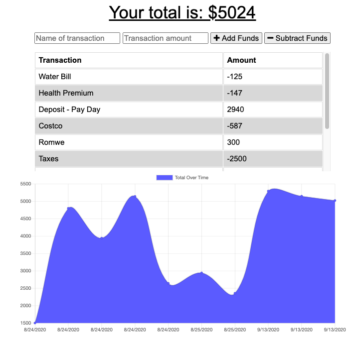

# Unit 18 PWA Homework: Online/Offline Budget Trackers

https://best-budget-tracker.herokuapp.com/

## Description

This assignment was to create a Budget Tracker application to allow for offline access and functionality for folks who want to keep track of expenses while traveling.

The application will allow users to add expenses and deposits and adjust their budget with or without an internet connection. When entering transactions offline, they should adjust the total when brought back online.

### Acceptance Criteria

When the user uses the application, they should be able to:

  * Enter deposits offline

  * Enter expenses offline

When brought back online:

  * Offline entries will be added to tracker.

### Results

The final application performs as expected and meets the requirements given above. 

### Images

- Tracker shows all entries logged: 
 